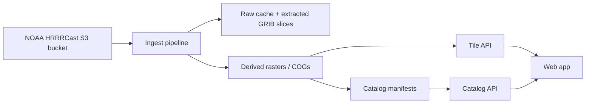

# Architecture

## System Flow

## Data Access Model

The NOAA bucket currently exposes:

- dated prefixes such as `HRRRCast/20260324/`
- hour prefixes such as `HRRRCast/20260324/01/`
- GRIB2 objects such as `hrrrcast.m00.t01z.pgrb2.f00`
- corresponding index files such as `hrrrcast.m00.t01z.pgrb2.f00.idx`

Inference:

- `m00` to at least `m05` indicates the product should be modeled as multi-member
- `.idx` files are sufficient for selective extraction of individual messages or variable families without always downloading full GRIB2 files

## Service Boundaries

### `pipelines/ingest`

Responsibilities:

- discover available dates, cycles, members, and forecast hours
- parse index files and select only fields needed for the viewer
- classify runs as `partial`, `ready`, or `failed` so the viewer does not deep-link to in-flight data as if it were complete
- derive viewer-ready products such as precipitation type, temperature, snowfall, reflectivity, CAPE, and pressure
- reproject or clip only if needed
- emit per-run manifests and asset metadata

Output contract:

- one metadata manifest per run
- one asset record per overlay/member/forecast hour
- one availability record per overlay/member/forecast hour so sparse or missing fields are explicit
- cloud-optimized raster outputs for tile serving

### `services/catalog-api`

Responsibilities:

- expose available runs
- expose available forecast hours per run/member
- expose run status and overlay availability per run/member/hour
- expose configured domains, baselayers, and overlays
- provide canonical URLs and layer metadata for the frontend

Suggested endpoints:

- `GET /api/runs/latest`
- `GET /api/runs`
- `GET /api/runs/{runId}`
- `GET /api/runs/{runId}/availability`
- `GET /api/domains`
- `GET /api/layers`

### `services/tile-api`

Responsibilities:

- serve raster tiles and TileJSON for precomputed products
- keep tile rendering logic out of the frontend
- support consistent color ramps and nodata handling
- remain raster-only in MVP; contour and vector products should be a separate extension, not an implicit requirement

Suggested endpoints:

- `GET /tiles/{runId}/{member}/{overlay}/{forecastHour}/tilejson.json`
- `GET /tiles/{runId}/{member}/{overlay}/{forecastHour}/{z}/{x}/{y}.png`

### `apps/web`

Responsibilities:

- URL-driven state
- domain navigation
- layer control panel
- forecast hour scrubber
- run/member picker
- mobile-safe layout

## Why Precomputed Tiles

Raw GRIB2 objects in the sample NOAA bucket are hundreds of megabytes each. Pulling those directly into a browser would produce poor startup time and repeated decode cost.

Precomputing map-ready products gives:

- predictable frontend performance
- easier color scale consistency
- simpler archive handling
- cleaner caching at the CDN level

It also lets the ingest layer make availability decisions up front when:

- a run is still publishing
- a member is missing
- a derived overlay cannot be produced for a specific hour

## Projection Strategy

For v1, the requested "domains" should be implemented as named camera presets in Web Mercator:

- `conus`
- `southeast`
- `northeast`
- `south_central`
- `northwest`
- `southwest`
- `carolinas`

This matches the target UX more closely than introducing true custom CRS support early. If you later want Lambert Conformal static render parity with operational model graphics, that can be added in the processing layer or a separate renderer.
